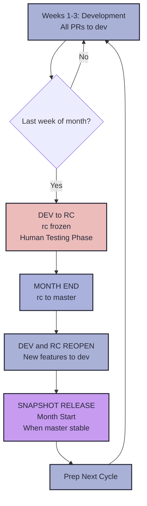
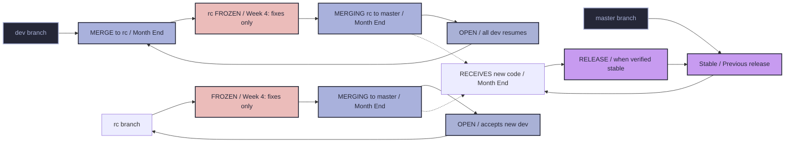
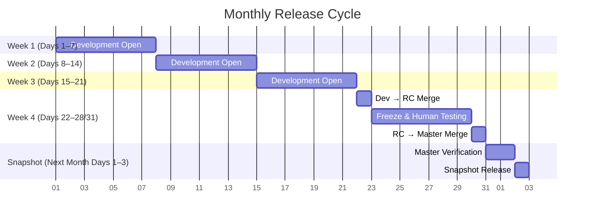

## Release & Branching Policy - Monthly Releases

[Jump To Calendar](#monthly-release-calendar-2026)

### Key Points

1. **Development** - All development and PRs target `dev`.
2. **Freeze Period** - During the last week of each month, `dev` is merged into `rc` (release-candidate) which is then *frozen* allowing only bug fixes and stabilization.
3. **Release Week** - Last week of the month: `rc` is merged into `master` after validation.
4. **Snapshots** - Snapshots are created when `master` is stable (typically end of release week).
5. **Schedule** - Monthly cycle: 3 weeks open development → 1 week freeze/testing → merge at month-end → snapshot early next month.

> [!NOTE]
> The `dev` branch is always open for new features and development during the first 3 weeks of each month. Only during the **Freeze Week** (last week of month) is the `rc` branch frozen for testing and bug fixes. At month-end, `rc` is merged to `master`. Snapshot releases happen early the next month. This gives ~3 weeks for human testers to validate changes properly.

---

## Monthly Cycle Breakdown

| Phase                              | Dev Branch | RC Branch    | Master Branch | Allowed Changes                                                    | Focus                          |
| ----------------------------------| ---------- | ------------ | ------------- | ------------------------------------------------------------------ | ------------------------------ |
| **Weeks 1-3** (Development)       | **OPEN**   | **OPEN**     | **Stable**    | **All features in `dev`** **Bug fixes in `rc`**                 | Active development & iteration |
| **Week 4** (Freeze & Test)        | **OPEN**   | **FROZEN**   | **Stable**    | **No new features in `rc`** **Bug fixes only in `rc`**          | Human testing & validation     |
| **Month End** (Merge)             | **OPEN**   | **MERGING**  | **RECEIVING** | **Merge `rc` → `master`** **Critical hotfixes in `rc`**         | Deploy stable code             |
| **Month Start** (Snapshot)        | **OPEN**   | **OPEN**     | **RELEASE**   | **Create snapshot release**                                        | Ship when stable               |

---

## In-Depth Monthly Timeline

| Period                      | Dev Status   | RC Status    | Master Status | Activity                          | Focus                    |
| --------------------------- | ------------ | ------------ | ------------- | --------------------------------- | ------------------------ |
| **Week 1** (Days 1-7)       | **OPEN**     | **OPEN**     | **Stable**    | New features, refactors, patches  | **Feature development**  |
| **Week 2** (Days 8-14)      | **OPEN**     | **OPEN**     | **Stable**    | Continued development, reviews    | **Iteration & review**   |
| **Week 3** (Days 15-21)     | **OPEN**     | **OPEN**     | **Stable**    | Polish, edge cases, docs          | **Polish & harden**      |
| **Week 4** (Days 22-28/31)  | **OPEN**     | **FROZEN**   | **Stable**    | **Human testing only** Bug fixes | **Testing & validation** |
| **Month End** (Days 28-31)  | **OPEN**     | **MERGING**  | **RECEIVING** | Merge `rc` → `master`             | **Deploy & verify**      |
| **Month Start** (Days 1-3)  | **OPEN**     | **OPEN**     | **RELEASE**   | Snapshot when stable              | **Ship it**              |

**Freeze period: 1 week per month (last week) — dedicated to human testing**

---

## Versioning YY.M.D

We use **year.month.day** format (`YY.M.D`) where:

- **YY.M** = Year.Month of the scheduled monthly release (e.g., `26.9` = September 2026)
- **D** = Day counter for iterations on that month's release (starts at 0)

Examples:
- `26.9.0` — Initial September 2026 release
- `26.9.1` — First hotfix/patch to September release
- `26.9.2` — Second hotfix/patch, etc.
- `26.10.0` — Initial October 2026 release (next month)

Benefits:
- **Release-cycle aligned:** `YY.M` matches monthly schedule; `D` tracks post-release iterations
- **Time-based clarity:** `26.9` = September 2026 at a glance
- **Hotfix friendly:** No versioning debates — just increment the day counter
- **Semantic clarity:** `.0` = initial release, `.1+` = patches/hotfixes
- **No arbitrary numbers:** No "major/minor/patch" semantics to argue about

---

## Pull Requests

- **Must** be made against `dev` branch
- Should be reviewed and approved by at least one other developer before merging
- Can be created anytime, but should be merged to `dev` before the Freeze Week
- Should not be merged directly into `master` branch
- Features merged during Freeze Week must wait for next cycle (exception: critical bug fixes)

---

# FLOWCHART

## Development Flow (Monthly)

```mermaid
graph TD
    A[Weeks 1-3: Development<br/>All PRs to dev] --> B{Last week of month?}
    B -->|Yes| C[DEV to RC<br/>rc frozen<br/>Human Testing Phase]
    B -->|No| A

    C --> D[MONTH END<br/>rc to master]
    D --> E[DEV and RC REOPEN<br/>New features to dev]
    E --> F[SNAPSHOT RELEASE<br/>Month Start<br/>When master stable]
    F --> G[Prep Next Cycle]
    G --> A

    classDef dev fill:#a9b1d6,stroke:#252737,stroke-width:2px,color:#252737
    classDef freeze fill:#ebbcba,stroke:#252737,stroke-width:2px,color:#252737
    classDef merge fill:#a9b1dc,stroke:#252737,stroke-width:2px,color:#252737
    classDef release fill:#c79bf0,stroke:#252737,stroke-width:2px,color:#252737

    class A,E,G dev
    class C freeze
    class D merge
    class F release
```

## Branch Flow

```mermaid
graph LR
    DEV[dev branch] --> RC_MERGE[MERGE to rc / Month End]
    RC_MERGE --> RC_FROZEN[rc FROZEN / Week 4: fixes only]
    RC_FROZEN --> MERGE_MASTER[MERGING rc to master / Month End]
    MERGE_MASTER --> OPEN[OPEN / all dev resumes]
    OPEN --> RC_MERGE

    RC2[rc branch] --> FROZEN2[FROZEN / Week 4: fixes only]
    FROZEN2 --> MERGE2[MERGING to master / Month End]
    MERGE2 --> OPEN2[OPEN / accepts new dev]
    OPEN2 --> RC2

    MASTER[master branch] --> STABLE[Stable / Previous release]
    STABLE --> RECEIVE[RECEIVES new code / Month End]
    RECEIVE --> RELEASE[RELEASE / when verified stable]
    RELEASE --> STABLE

    MERGE_MASTER -.-> RECEIVE
    MERGE2 -.-> RECEIVE

    classDef dev fill:#a9b1d6,stroke:#252737,stroke-width:2px,color:#252737
    classDef freeze fill:#ebbcba,stroke:#252737,stroke-width:2px,color:#252737
    classDef merge fill:#a9b1dc,stroke:#252737,stroke-width:2px,color:#252737
    classDef stable fill:#c79bf0,stroke:#252737,stroke-width:2px,color:#252737
    classDef dark fill:#252737,stroke:#a9b1d6,stroke-width:2px,color:#a9b1d6

    class DEV,OPEN,OPEN2 dev
    class RC_FROZEN,FROZEN2 freeze
    class RC_MERGE,MERGE_MASTER,MERGE2 merge
    class STABLE,RELEASE stable
    class MASTER,DEV dark
```

## Monthly Release Schedule

```mermaid
gantt
    title Monthly Release Cycle
    dateFormat  YYYY-MM-DD
    axisFormat  %d

    section Week 1 (Days 1–7)
    Development Open          :dev1, 2026-01-01, 7d

    section Week 2 (Days 8–14)
    Development Open          :dev2, after dev1, 7d

    section Week 3 (Days 15–21)
    Development Open          :dev3, after dev2, 7d

    section Week 4 (Days 22–28/31)
    Dev → RC Merge            :devrc, after dev3, 1d
    Freeze & Human Testing    :freeze, after devrc, 7d
    RC → Master Merge         :rcmaster, after freeze, 1d

    section Snapshot (Next Month Days 1–3)
    Master Verification       :verify, after rcmaster, 2d
    Snapshot Release          :release, after verify, 1d
```

# Monthly Release Calendar 2026+

| Month | Freeze Week Starts | Merge to Master | Snapshot Release | Version Tag |
|-------|-------------------|-----------------|------------------|-------------|
| **Sep 2026** (monthly begins) | **2026-09-28** | **2026-09-30** | **2026-10-02** | **26.9.0** |
| Oct 2026 | 2026-10-26 | 2026-10-30 | 2026-11-02 | 26.10.0 |
| Nov 2026 | 2026-11-30 | 2026-11-30 | 2026-12-02 | 26.11.0 |
| Dec 2026 | 2026-12-28 | 2026-12-31 | 2027-01-04 | 26.12.0 |
| Jan 2027 | 2027-01-25 | 2027-01-29 | 2027-02-01 | 27.1.0 |
| Feb 2027 | 2027-02-22 | 2027-02-26 | 2027-03-01 | 27.2.0 |
| Mar 2027 | 2027-03-29 | 2027-03-31 | 2027-04-02 | 27.3.0 |
| Apr 2027 | 2027-04-26 | 2027-04-30 | 2027-05-03 | 27.4.0 |
| May 2027 | 2027-05-31 | 2027-05-31 | 2027-06-02 | 27.5.0 |
| Jun 2027 | 2027-06-28 | 2027-06-30 | 2027-07-02 | 27.6.0 |
| Jul 2027 | 2027-07-26 | 2027-07-30 | 2027-08-02 | 27.7.0 |
| Aug 2027 | 2027-08-30 | 2027-08-31 | 2027-09-02 | 27.8.0 |
| Sep 2027 | 2027-09-27 | 2027-09-30 | 2027-10-01 | 27.9.0 |

---

**Note:** Jan–Aug 2026 used fortnightly releases (YY.M.W). Monthly (YY.M.D) begins Sep 2026 with `26.9.0`.
