## Release & Branching Policy - Fortnightly Releases

[Jump To Calendar](#fortnightly-release-calendar-for-2025)

#### Key Points

1. **🛠️Development** - All development and PRs target `dev`.
2. **🚫Freeze Week** - On Freeze Week the `dev` branch is merged into the `rc` (release-candidate) branch which is then *frozen* allowing only bug fixes and stabilisation.
3. **✅Release Week** - On Release Week the `rc` branch is merged into `master`.
4. **📦Shapshots** -  Snapshots are only created when `master` is stable.
5. **🔄Schedule** - Freeze Weeks And Release Weeks alternate **every Friday** beginning with Release Week. This means that every *odd* Friday is a Release Week and every *even* Friday is a Freeze Week.

> [!NOTE] 
> The `dev` branch is always open for new features and development *every* week, regardless of the release cycle. Only the `rc` branch is frozen for testing and bug fixes for release preparation during Freeze Week.

---

## Weekly Breakdown

| Phase                                     | Dev Branch Status   | RC Branch Status   | Allowed Changes                                                            | Description               |
| ------------------------------------------| ------------------- | ------------------ | ---------------------------------------------------------------------------| ------------------------- |
| **Freeze Week** (during odd weeks)        | ✅**OPEN**          | 🚫**FROZEN**       | ⌠No new features in `rc` ✅ Bug fixes in `rc` ✅ All dev in `dev`  | Testing and validation    |
| **Merge Friday** (on odd Fridays)         | ✅**OPEN**          | 🔄**MERGING**      | 🔄 Merge `rc` to master                                                    | Deploy stable code        |
| **Stabilization Week** (after merge)      | ✅**OPEN**          | ✅**OPEN**         | ✅ All development in `dev` 🔧 Critical hotfixes in `rc`                | Monitor master & develop  |
| **Snapshot Release**                      | ✅**OPEN**          | 📦**RELEASE**      | 📦 Create release                                                          | When `master` is stable   |

---

## In-Depth Monthly Timeline

| Period                         | Dev Status          | RC Status           | Master Status          | Activity                    | Focus                  |
| -------------------------------| --------------------| --------------------| ---------------------- | --------------------------- | ---------------------- |
| **During 1st Week**            | ✅**OPEN**          | 🚫**FROZEN**        | 🔧 Previous fixes      | Testing & validation        | 🧪 Prepare for merge   |
| **1st Friday**                 | ✅**OPEN**          | 🔄**MERGING**       | 📥 Receives new code   | Merge `rc` → `master`       | 🔄 Deploy              |
| **During 2nd Week**            | ✅**OPEN**          | ✅**OPEN**          | 🔧 Hotfixes only       | Active development          | 🚀 New features to dev |
| **2nd Friday**                 | ✅**OPEN**          | ✅**OPEN**          | 📦**SNAPSHOT**         | Release when stable         | 📦 Release             |
| **During 3rd Week**            | ✅**OPEN**          | 🚫**FROZEN**        | 🔧 Minor fixes only    | Testing & validation        | 🧪 Prepare for merge   |
| **3rd Friday**                 | ✅**OPEN**          | 🔄**MERGING**       | 📥 Receives new code   | Merge `rc` → `master`       | 🔄 Deploy              |
| **During 4th Week**            | ✅**OPEN**          | ✅**OPEN**          | 🔧 Hotfixes only       | Active development          | 🚀 New features to dev |
| **4th Friday**                 | ✅**OPEN**          | ✅**OPEN**          | 📦**SNAPSHOT**         | Release when stable         | 📦 Release             |

**Freeze periods: allows ~2 weeks per month (handles variable month lengths)**

---

## Versioning YY.M.W

We use **year.month.week** format (`YY.M.W`) instead of traditional semantic versioning for several reasons:

- **Release-cycle aligned:** Matches our fortnightly release schedule perfectly
- **Time-based clarity:** Instantly shows when a release was made
- **Predictable progression:** Always `.1` then `.3` each month
- **No arbitrary numbers:** No confusion about what constitutes "major" vs "minor"
- **User-friendly:** Easy to understand - `25.7.1` = "1st Week of July 2025"

---

## Pull Requests

- *Must* be made against`dev` branch
- Should be reviewed and approved by at least one other developer before merging
- Can be created anytime, but should be merged to`dev` branch before releasing on`master` branch
- Should not be merged directly into`master` branch
- Should be merged within the release window for`master` branch

---

# FLOWCHART 

Here are some visuals to help you understand the flowchart better.

## Development Flow

```mermaid
graph TD
    A[Normal Development<br/>✅ All PRs to dev] --> B{Even Friday?}
    B -->|Yes| C[🔄 DEV → RC<br/>rc frozen<br/>🧪 Testing Phase]
    B -->|No| A
    
    C --> D[🔄 MERGE DAY<br/>Odd Friday<br/>rc → master]
    D --> E[✅ DEV & RC REOPEN<br/>New features to dev]
    E --> F[📦 SNAPSHOT RELEASE<br/>Even Friday<br/>Whenever master stable]
    F --> G[🔄 Prep Next Cycle]
    G --> A
    
    style A fill:#a9b1d6,stroke:#252737,stroke-width:2px,color:#252737
    style C fill:#ebbcba,stroke:#252737,stroke-width:2px,color:#252737
    style D fill:#a9b1dc,stroke:#252737,stroke-width:2px,color:#252737
    style E fill:#a9b1d6,stroke:#252737,stroke-width:2px,color:#252737
    style F fill:#c79bf0,stroke:#252737,stroke-width:2px,color:#252737
    style G fill:#ebbcba,stroke:#252737,stroke-width:2px,color:#252737
```

## Branch Flow

```mermaid
graph LR
    subgraph "Dev Branch"
        DEV[dev branch] --> RC[🔄 MERGE<br/>to rc]
        RC --> FROZEN[🚫 rc FROZEN<br/>fixes only]
        FROZEN --> MERGE[🔄 MERGING<br/>rc to master]
        MERGE --> OPEN[✅ OPEN<br/>all dev]
        OPEN --> RC
    end
    
    subgraph "RC Branch"
        RC2[rc branch] --> FROZEN2[🚫 FROZEN<br/>fixes only]
        FROZEN2 --> MERGE2[🔄 MERGING<br/>to master]
        MERGE2 --> OPEN2[✅ OPEN<br/>accepts new dev]
        OPEN2 --> RC2
    end
    
    subgraph "Master Branch"
        MASTER[master branch] --> PREV[🔧 Previous fixes]
        PREV --> RECEIVE[📥 RECEIVES<br/>new code]
        RECEIVE --> RELEASE[📦 RELEASE<br/>whenever stable]
        RELEASE --> PREV
    end
    
    MERGE -.-> RECEIVE
    MERGE2 -.-> RECEIVE
    
    style DEV fill:#252737,stroke:#a9b1d6,stroke-width:2px,color:#a9b1d6
    style RC fill:#a9b1dc,stroke:#252737,stroke-width:2px,color:#252737
    style FROZEN fill:#ebbcba,stroke:#252737,stroke-width:2px,color:#252737
    style MERGE fill:#a9b1dc,stroke:#252737,stroke-width:2px,color:#252737
    style OPEN fill:#a9b1d6,stroke:#252737,stroke-width:2px,color:#252737
    style RC2 fill:#a9b1dc,stroke:#252737,stroke-width:2px,color:#252737
    style FROZEN2 fill:#ebbcba,stroke:#252737,stroke-width:2px,color:#252737
    style MERGE2 fill:#a9b1dc,stroke:#252737,stroke-width:2px,color:#252737
    style OPEN2 fill:#a9b1d6,stroke:#252737,stroke-width:2px,color:#252737
    style MASTER fill:#252737,stroke:#a9b1d6,stroke-width:2px,color:#a9b1d6
    style PREV fill:#c79bf0,stroke:#252737,stroke-width:2px,color:#252737
    style RECEIVE fill:#a9b1dc,stroke:#252737,stroke-width:2px,color:#252737
    style RELEASE fill:#a9b1d6,stroke:#252737,stroke-width:2px,color:#252737
```

## Fortnightly Release Schedule

# Fortnightly Release Calendar for 2025

| Month     | Freeze Week  | Merge Friday | Snapshot     | Week | Tag     |
|-----------|--------------|--------------|--------------|-------|---------|
| Jan       | 2024-12-27   | 2025-01-03   | 2025-01-10   | W1    | 25.1.1  |
|           | 2025-01-10   | 2025-01-17   | 2025-01-24   | W3    | 25.1.3  |
| Feb       | 2025-01-31   | 2025-02-07   | 2025-02-14   | W1    | 25.2.1  |
|           | 2025-02-14   | 2025-02-21   | 2025-02-28   | W3    | 25.2.3  |
| Mar       | 2025-02-28   | 2025-03-07   | 2025-03-14   | W1    | 25.3.1  |
|           | 2025-03-14   | 2025-03-21   | 2025-03-28   | W3    | 25.3.3  |
| Apr       | 2025-03-28   | 2025-04-04   | 2025-04-11   | W1    | 25.4.1  |
|           | 2025-04-11   | 2025-04-18   | 2025-04-25   | W3    | 25.4.3  |
| May       | 2025-04-25   | 2025-05-02   | 2025-05-09   | W1    | 25.5.1  |
|           | 2025-05-09   | 2025-05-16   | 2025-05-23   | W3    | 25.5.3  |
| Jun       | 2025-05-30   | 2025-06-06   | 2025-06-13   | W1    | 25.6.1  |
|           | 2025-06-13   | 2025-06-20   | 2025-06-27   | W3    | 25.6.3  |
| Jul       | 2025-06-27   | 2025-07-04   | 2025-07-11   | W1    | 25.7.1  |
|           | 2025-07-11   | 2025-07-18   | 2025-07-25   | W3    | 25.7.3  |
| Aug       | 2025-07-25   | 2025-08-01   | 2025-08-08   | W1    | 25.8.1  |
|           | 2025-08-08   | 2025-08-15   | 2025-08-22   | W3    | 25.8.3  |
| Sep       | 2025-08-29   | 2025-09-05   | 2025-09-12   | W1    | 25.9.1  |
|           | 2025-09-12   | 2025-09-19   | 2025-09-26   | W3    | 25.9.3  |
| Oct       | 2025-09-26   | 2025-10-03   | 2025-10-10   | W1    | 25.10.1 |
|           | 2025-10-10   | 2025-10-17   | 2025-10-24   | W3    | 25.10.3 |
| Nov       | 2025-10-31   | 2025-11-07   | 2025-11-14   | W1    | 25.11.1 |
|           | 2025-11-14   | 2025-11-21   | 2025-11-28   | W3    | 25.11.3 |
| Dec       | 2025-11-28   | 2025-12-05   | 2025-12-12   | W1    | 25.12.1 |
|           | 2025-12-12   | 2025-12-19   | 2025-12-26   | W3    | 25.12.3 |
